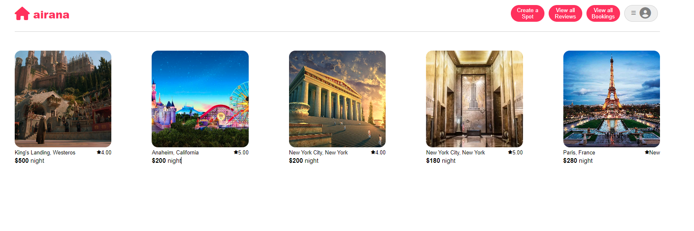
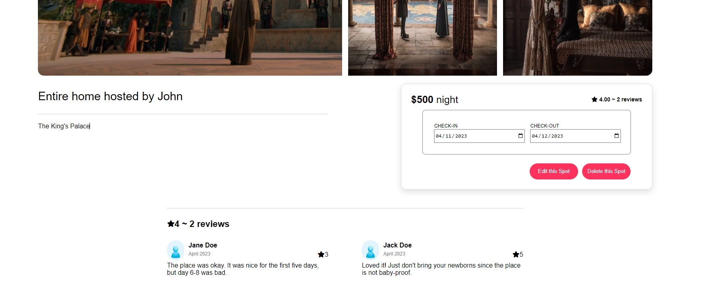
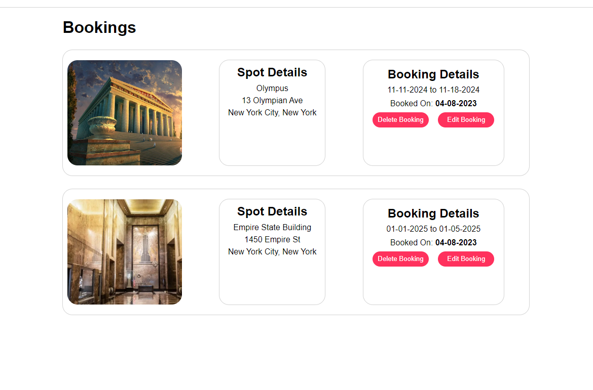

# `AirBnB Clone: AirAnA`

## AirAnA Link:
https://airbnb-clone-hugz.onrender.com

## AirAnA Description:
AirAnA is an AirBnB clone, utilizing the naming acronym of App Academy (Aa) to replace the B's in AirBnB. It is an application clone limited in functionality.

## AirAnA Technology:
* [![React][React.js]][React-url]
* [![Redux][Redux.js]][Redux-url]
* [![Express][Express.js]][Express-url]
* [![Sequelize][Sequelize.js]][Sequelize-url]
* [![Sqlite3][Sqlite3]][Sqlite3-url]

## AirAnA Features

### Users/Sessions
Users are able to sign up with a username & password to perform actions available only to logged in users.
Users are unable to create duplicate username/email credentials.

### Spots
All users are able to view different spots in the database.
Logged in users are able to create listings for spots, being able to set price and location.
Logged in spot owners are able to update and delete existing spots.

### Reviews
Users are able to view reviews for a spot.
Users are able to view all reviews they have left.
Logged in users are able to leave a review for a spot, being able to input stars and text.
Users who leave reviews are able to delete the ones they created.

## Roadmap:
* Future Features:
    * Logged in users can edit reviews they made
    * Users can delete their account
    * Users can make bookings for spots owned by other users
    * Users can add more images to newly created spots in the creation and updating modals

## Screenshots:

## Contact:
* Kevin Ong - kevin.ong@live.com
* [Github - Kong1214](https://github.com/kong1214)
* [Github - Project Link](https://github.com/kong1214/airbnb-clone)

<!-- MARKDOWN LINKS & IMAGES -->
<!-- https://www.markdownguide.org/basic-syntax/#reference-style-links -->
[React.js]: https://img.shields.io/badge/React-20232A?style=for-the-badge&logo=react&logoColor=61DAFB
[React-url]: https://reactjs.org/
[Redux.js]: https://img.shields.io/badge/Redux-593D88?style=for-the-badge&logo=redux&logoColor=white
[Redux-url]: https://redux.js.org/
[Express.js]: https://img.shields.io/badge/express.js-%23404d59.svg?style=for-the-badge&logo=express&logoColor=%2361DAFB
[Express-url]: https://expressjs.com/
[Sqlite3]: https://img.shields.io/badge/SQLite-07405E?style=for-the-badge&logo=sqlite&logoColor=white
[Sqlite3-url]: https://www.sqlite.org/index.html
[Sequelize.js]: https://img.shields.io/badge/Sequelize-52B0E7?style=for-the-badge&logo=Sequelize&logoColor=white
[Sequelize-url]: https://sequelize.org/
